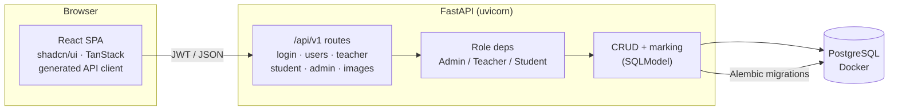

# Quizzer

A full-stack quiz & assessment platform for classrooms. Teachers build courses,
quizzes, and timed tests; students enroll with a PIN, take assessments that are
**auto-graded** across four question types, and keep study notes; admins manage
users and storage. Role-based access throughout.


Built on the [Full Stack FastAPI Template](https://github.com/fastapi/full-stack-fastapi-template)
structure: **FastAPI + SQLModel + PostgreSQL** on the backend, **React + shadcn/ui +
TanStack Router/Query** on the frontend, with a fully type-safe generated API client.

---

## Screenshots

> Placeholders — drop real captures into `docs/screenshots/` and they'll render here.

| Student — take a quiz | Teacher — author questions | Teacher — progress |
| --- | --- | --- |
|  |  |  |

---

## Features

**Students**
- Enroll in a course with its title + PIN
- Take quizzes (configurable attempt limits) and **timed tests** (open/close window + duration)
- Four question types: single choice, multiple choice, true/false, user input
- Instant auto-graded feedback; correct answers are hidden until a test ends
- Personal study notes

**Teachers**
- Create courses (auto-generated enrollment PIN)
- Create quizzes and timed tests
- Author questions of all four types with validation (e.g. single-choice must have exactly one correct answer)
- See enrolled students and per-student progress (raw + weighted marks, attempts)

**Admins**
- Manage users and assign roles (student / teacher / admin)
- Prune uploaded images no longer referenced by any question or note

---

## Tech stack

| Layer | Tech |
| --- | --- |
| Backend | FastAPI, SQLModel, Pydantic v2, Alembic, PostgreSQL, `uv`, Ruff |
| Auth | JWT (PyJWT), argon2/bcrypt password hashing (`pwdlib`), role-based deps |
| Frontend | React 19, TypeScript, Vite, TanStack Router + Query, shadcn/ui + Tailwind v4, `bun` |
| API client | Auto-generated & fully typed from the OpenAPI schema (`@hey-api/openapi-ts`) |
| Tests | pytest (backend), typecheck + build (frontend) |
| CI/Infra | GitHub Actions, Docker (Postgres) |

---

## Architecture



Only **PostgreSQL runs in Docker**; the backend and frontend run natively for a
fast dev loop.

---

## Quick start

**Prerequisites:** [`uv`](https://docs.astral.sh/uv/), [`bun`](https://bun.sh/), and Docker.

```bash
# 1. Environment
cp .env.example .env            # generate a real SECRET_KEY & POSTGRES_PASSWORD

# 2. Postgres (Docker)
docker compose up -d            # starts Postgres + creates the test database

# 3. Backend (native)  ->  http://localhost:8000
cd backend
uv sync
uv run alembic upgrade head     # apply migrations
uv run python app/initial_data.py  # seed the first admin
uv run fastapi dev app/main.py

# 4. Frontend (native) ->  http://localhost:5173
cd ../frontend
cp .env.example .env            # VITE_API_URL -> backend
bun install
bun run dev
```

Open the API docs at <http://localhost:8000/docs> and the app at
<http://localhost:5173>. Log in as the seeded admin (`FIRST_SUPERUSER` /
`FIRST_SUPERUSER_PASSWORD` from `.env`), or sign up (new accounts are students)
and enroll with a teacher's course PIN.

> The generated frontend client lives in `frontend/src/client`. To regenerate it
> after backend API changes: fetch `http://localhost:8000/api/v1/openapi.json`
> into `frontend/openapi.json`, then `bun run generate-client`.

---

## Configuration

Key environment variables (see `.env.example` for the full list):

| Variable | Purpose |
| --- | --- |
| `SECRET_KEY` | JWT signing key (**required**, generate a strong one) |
| `POSTGRES_SERVER` / `_PORT` / `_DB` / `_USER` / `_PASSWORD` | Database connection |
| `FIRST_SUPERUSER` / `FIRST_SUPERUSER_PASSWORD` | Seeded admin account |
| `BACKEND_CORS_ORIGINS` | Comma-separated allowed frontend origins |
| `UPLOAD_DIRECTORY` | Where uploaded images are stored |
| `VITE_API_URL` (frontend) | Base URL of the backend API |

Secrets are never committed — `.env` is gitignored.

---

## Testing

```bash
cd backend
uv run pytest              # 18 tests: marking, auth/RBAC, full domain flow
uv run ruff check app tests

cd ../frontend
bunx tsc --noEmit -p tsconfig.build.json
bunx biome check
bun run build
```

CI runs the same checks on every push/PR (`.github/workflows/ci.yml`).

---

## Roles

| Role | Can |
| --- | --- |
| **student** | enroll, take quizzes/tests, submit answers, keep notes |
| **teacher** | create courses/quizzes/tests, author questions, view progress |
| **admin** | manage users & roles, prune storage (also a superuser) |

Public signup always creates a **student** — roles can only be elevated by an admin.

---

## Project structure

```
backend/
  app/
    api/routes/     login, users, teacher, student, admin, images
    core/           config, db, security
    crud/           per-domain CRUD (course, quiz, question, submission, note, progress)
    models/         SQLModel tables + JSONB payload schemas
    marking.py      auto-grading for all question types
    alembic/        migrations
  tests/            pytest suite
frontend/
  src/
    routes/         TanStack file-based routes (_layout, auth)
    components/     Student, Teacher, Admin, Sidebar, ui (shadcn)
    client/         generated, typed API client
compose.yml         Postgres-only dev stack
```

---

## License

[MIT](LICENSE)
